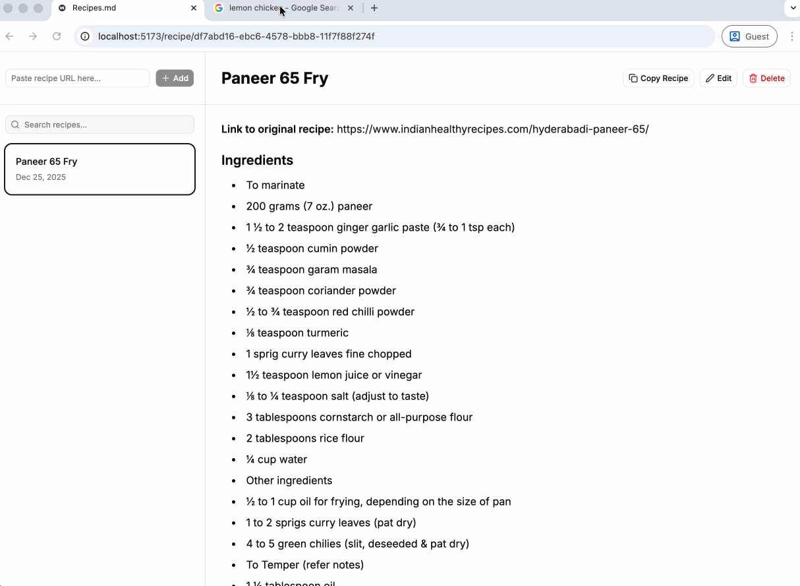

# Recipes.md

A web app for scraping and managing recipes, inspired from [Python CLI version](https://github.com/devmrin/pure-recipe-py).



## Features

- **One-click recipe addition**: Paste a recipe URL and it's automatically scraped and saved
- **Cookbook sidebar**: Browse all your saved recipes
- **Recipe preview**: View recipes with beautiful markdown rendering
- **Copy to clipboard**: One-click copy any recipe
- **Search**: Find recipes quickly with search functionality
- **Persistent storage**: Recipes stored locally in IndexedDB

## Getting Started

### Prerequisites

- Node.js 18+ and pnpm

### Installation

1. Install dependencies:
```bash
pnpm install
```

2. Install backend dependencies:
```bash
cd server && pnpm install
```

### Development

Run both frontend and backend together:
```bash
pnpm dev:all
```

Or run them separately:

**Frontend only:**
```bash
pnpm dev
```

**Backend only:**
```bash
pnpm dev:server
```

The frontend will be available at `http://localhost:5173` and the backend at `http://localhost:3001`.

### Environment Variables

Create a `.env` file in the root directory (optional):

```env
VITE_API_URL=http://localhost:3001
```

### Building

Build the frontend:
```bash
pnpm build
```

Build the backend:
```bash
cd server && pnpm build
```

## Project Structure

```
.
├── src/                    # Frontend React application
│   ├── components/         # React components
│   ├── lib/                # Utilities (storage, scraper client)
│   └── routes/             # TanStack Router routes
├── server/                 # Backend Express server
│   └── src/
│       ├── index.ts        # Express server entry point
│       └── scraper.ts      # Recipe scraping logic
└── package.json
```

## How It Works

1. User pastes a recipe URL in the sidebar
2. Frontend sends request to backend API (`/api/scrape-recipe`)
3. Backend fetches the recipe page and extracts recipe data using JSON-LD structured data and HTML parsing
4. Backend formats the recipe as markdown and returns it
5. Frontend saves the recipe to IndexedDB and displays it

## Backend API

See [server/README.md](server/README.md) for backend API documentation.

## Technologies

- **Frontend**: React, TypeScript, TanStack Router, Dexie (IndexedDB), react-markdown
- **Backend**: Express, TypeScript, Cheerio (HTML parsing), node-fetch
- **UI**: Tailwind CSS
